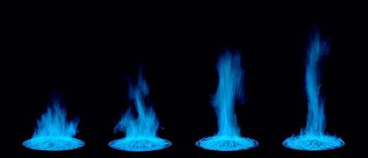
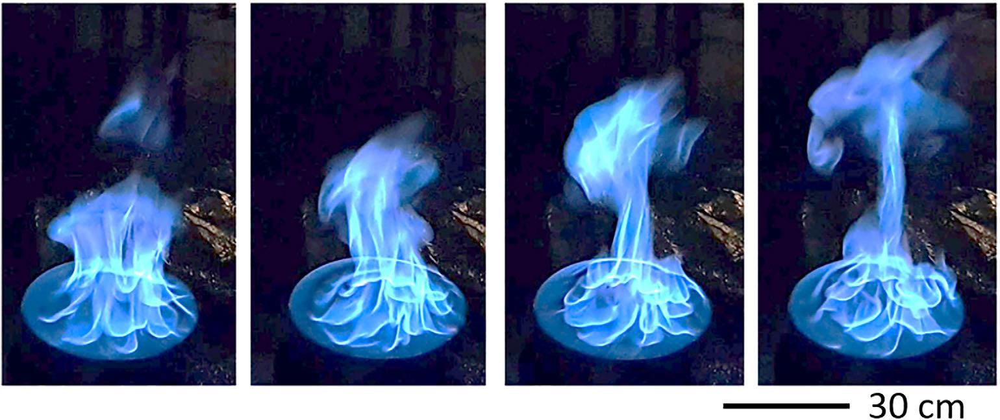
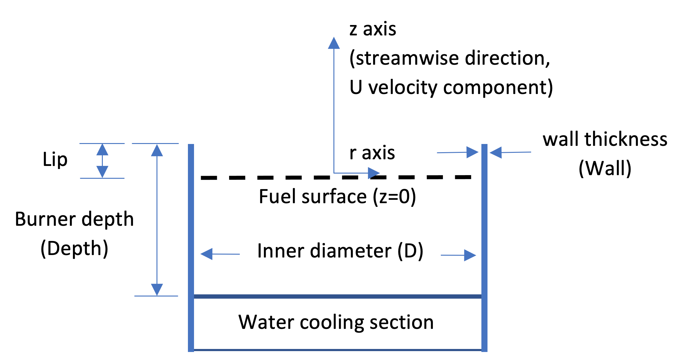

## 1. Overview of NIST Pool Fire Data 
This directory contains experimental data from measurements in eight steadily burning liquid and gaseous pool fires established in a well-ventilated, quiescent environment. Results using 30 cm and 100 cm diameter, circular, water-cooled, liquid pool burners are reported. Results using a 37 cm diameter, water-cooled, gaseous burner are also reported.  A warm-up period of 5 to 10 min was required for the fires to become quasi-steady. 

This README file is broken into several parts:    
1. Overview of NIST Pool Fire Data
2. Description of Burners, Coordinate Systems and Boundary Conditions
   2.1 Burners
   2.2 Fuel Mass Flux
   2.3 Surface Temperature
3. Global Measurements
   3.1 Radiative Fraction
   3.2 Puffing Frequency
   3.3 Flame Height
   3.4 Total Heat Feedback to the Fuel Surface
   3.5 Soot and CO Yields
   3.6 Heat Release Rate (HRR)
   3.7 Combustion Efficiency
4. Local Measurements
   4.1 Gas-Phase Temperature
   4.2 Gas Species and Soot
   4.3 Heat Flux
   4.4 Velocity
   4.5 Liquid FUel Temperature
6. References
7.  List of Contributors to the Measurements

The **MaCFP 2** meeting focused on the structure of the 30 cm and 100 cm methanol pool fires described in Table 1.1 below.  The **MaCFP 3** meeting is focused on the centerline chemical species profiles and supporting information in all eight of the pool fires listed in Table 1.1  Additional information on the 30 cm methanol pool fire is available from the University of Waterloo - see: https://github.com/MaCFP/macfp-db/tree/master/Liquid_Pool_Fires/Waterloo_Methanol)

**Table 1.1    The measured fuel mass flux ($\dot m$''), surface temperature (Tsurf ), radiative fraction, and dominant puffing frequency for gaseous and liquid pool fires; also listed are locations of the thermocouple temperature profile data. The thermocouple bead diameter for each specific temperature profile is listed in Table 4.1 (below). The uncertainties in the table represent the standard deviation of the measured values.**  

| ID   | Fuel     | $\dot m$‘’ | Tsurf ++ | Rad Frac  | Freq      | TC Profiles              | References                        |   
|------|----------|------------|----------|-----------|-----------|--------------------------|-----------------------------------|
| cm   |      -   |  g/(m2-s)  | °C       | -         | Hz        | -                        | -                                 | 
| 30.1 | Methanol | 13.1±0.9   | 65±1     | 0.226±0.09 | 2.49±0.04 | r=0; z=3.8,30.8,41,51,61 | 1,2,3+,4,5+, 6*,7,9,10,14+, 15**  |
| 30.1 | Ethanol  | 14.8±1.2   | 79±2     | 0.275±0.02 | 2.41±0.10 | r=0                      | 1,2,3+,6*                         |
| 30.1 | Acetone  | 18.3±0.6   | 57±1     | 0.31±0.02  | 2.45±0.12 | r=0                      | 1,2,3+,6*                         |
| 37   | Methane  | 6.41±0.1   | 60±20    | 0.217±0.006 | 2.48±0.10 | r=0                      | 3+,++,12*,13*                     |
| 37    | Propane  | 4.16±0.1  | 60±20    | 0.226±0.003| 2.32±0.10|r=0                      |  3+,++,12\, 16\*,\*\*                     |
| 37    | Propane  | 6.91±0.1  | 60±20    | 0.301±0.003 | 2.41±0.10|r=0                      |  3+,++,12\, 16\*,\*\*                     |
| 37    | Propane  | 10.0±0.1  | 60±20    | 0.326±0.003 | 2.7±0.11 |r=0                      | 3+,++,12\, 16\*,\*\*                     |
| 100.6 | Methanol | 16.3±0.2  | 65± 1    | 0.21±0.01  | 1.37±0.03|r=0;z=21,61,101,141,181| 1\*,7\*,8*,**\*,8*\*,14+   |

\* Radiative fraction  
\*\* Puffing frequency  
+ thermocouple (TC) properties.  
++ The fuel surface temperature for the liquid pool fires is nearly the fuel boiling point [18].   Measurements at the pool surface [3,8] show that the temperature for the liquid fuels (methanol, ethanol and acetone) slowly increases on the order of 1 deg C over the duration of the experiment.  the fuel temperature See the discussion on fuel surface temperature below.  

**Sequential photographs during a puffing cycle of the 100 cm methanol pool fire.**

**Sequential photographs during a puffing cycle of the 30 cm methanol pool fire.**

## 2. Description of Burners, Coordinate System and Boundary Conditions
### 2.1 Burners

The image above is a schematic drawing of a liquid burner, illustrating its features and coordinate system used here. Table 2.1 below lists the 30 cm and 100 cm liquid burners' diameter, depth, and wall thickness for various studies of interest. The lip height (distance between fuel surface and top of burner rim) used in the various references is also listed.  For comparison, the 37 cm NIST gas burner and the Waterloo liquid burners are also listed.
 

**Table 2.1   Description of NIST burners, including the inner diameter, lip height, depth, wall thickness, and material.  Also shown, is whether the burner is water-cooled.** 

| ID (cm)| Lip (mm) | Depth (cm) | Wall (mm) | Material     |Water-Cooled Burner?| References |
|-------|:--------:|:----------:|:---------:|---------------|:------------------:|------------|
| 30.1  | 5        | 15         | 1.3       |stainless steel|     Yes            | 1,4,5,8    |
| 30.1  | 10       | 15         | 1.3       |stainless steel|     Yes            | 2,3,6,15   |
| 37    | 0        |  8         | NA        |porous bronze  |     Yes            | 1,12,16    |    
| 100   | 5        | 15         | 1.7       |steel          |     Yes            |7           |
| 100   | 10       | 15         | 1.7       |steel          |     Yes            |8           |

   * The "30 cm NIST burner" is made of stainless steel and has an inner diameter (ID) of 30.1 cm, a wall thickness of 1.3 mm, and a depth of 15 cm. [6] The stainless steel burner is fitted with legs such that the burner rim is positioned 30 cm above the floor. The bottom of the burner is maintained at a near constant temperature by flowing tap water (nominally 20 °C) through a 3 cm section attached to the bottom of the fuel pan. 

* The "100 cm NIST burner" is made of steel and has an inner diameter of 100 cm, a depth of 15 cm, and a wall thickness of 1.6 mm. The bottom of the burner is maintained at a near constant temperature by flowing tap water (about 17 ± 3°C) through a 3 cm section attached to the bottom of the fuel pan.  The burner was positioned on bricks such that the rim was about 40 cm above the floor. [8,14] 

* The Waterloo burner was reported to be 30.5 cm in diameter. [10]  The outer diameter of the burner is equal to 30.5 cm, the wall thickness is 0.15 cm, and the depth is 6.0 cm [9], so the inner diameter is 30.2 cm  The lip height of the fire in the Waterloo burner was maintained at 10 mm.  The burner was not water-cooled on the bottom of its fuel section. Additional information is available at: https://github.com/MaCFP/macfp-db/tree/master/Liquid_Pool_Fires/Waterloo_Methanol

* For convenience, all experimental data reported here use a cylindrical coordinate system with the **fuel surface as the z-axis origin** (see burner drawing above) and the pool center as the r-axis origin.

* **NOTE**: In some instances the coordinate frame has been shifted from what was reported in the literature such that the origin is the fuel surface instead of the top of the burner rim. (Many of the liquid pool fire studies report results using the burner rim, i.e., the top of the burner lip, as the z-axis origin [e.g., 4,5,6,7]. Other liquid pool fire studies report results using the fuel surface as the z-axis origin [3].) 

* The **lip height** (distance from the top of the burner rim to the fuel surface - see the burner schematic drawing above) varied from study to study (see table 2.1 above). 

     * For the 30 cm diameter methanol pool fires, [3,6,8,10,14] report a lip height of 10 mm, whereas other studies [4,5,7] report a lip height of 5 mm.

     * For the 30 cm diameter ethanol and acetone pool fires, Ref. [6] reports a lip height of 10 mm.

     * The lip height of the 37 cm gaseous burner studies was zero. 

### 2.2 Fuel Mass Flux

* Table 1.1 at the top of the page shows the measured mass flux for all the pool fires averaged over the results reported by the references in the table.
* The measured mass flux in the 30 cm methanol pool fire, averaged over many studies, is 13.1± 0.9 g/(m2-s). [1,2,3,4,6,7,10,15]

### 2.3 Fuel Surface Temperature

* Table 1.1 above shows the measured fuel surface temperatures for the fires burning liquid and gaseous fuels.  
     * For the liquid fuels studied here, measurements show that the fuel surface temperature is close to the fuel boiling point [3, 8].  
     * The measured surface temperature slightly increased over the duration of the experiments until their values were on the order of 1 °C above the boiling point of the pure fuel. We speculate that this is due to the slow back-diffusion of gas phase water (as well as possibly other molecules) condensing on the liquid fuel surface, diluting the composition of the liquid pool surface from that of a pure fuel.  
     * The 37 cm gaseous burner (zero lip height) is water-cooled and maintains a near-isothermal (±20 K) temperature about the burner surface as documented by IR camera measurements. [3]  Type K thermocouple measurements of the surface show that its temperature is within about 10 °C of the outflow temperature of the gas burner's cooling water (which depends on the water flow rate - nominally set to about 1 L/min). The surface temperature was typically 60 °C for the data sets reported here.
  

## 3. Global Measurements

### 3.1 Radiative Fraction

* Table 1.1 at the top of the page shows the measured radiative fraction for the pool fires averaged over the results reported by the cited references.

* 30 cm Methanol Pool Fire

     * The measured radiative fraction for the 30 cm methanol pool fire, averaged over the various studies, is 0.22 ± 0.02 based on the cited references [1,6]; also see discussion of Ref. [7] in Ref. [8].

* 100 cm Methanol Pool Fire

     * The measured radiative fraction for the 100 cm methanol pool fire is 0.21 ± 0.01. [8]
      
     * The radiative fraction for the 100 cm methanol pool fire measured by Klassen and Gore [7] was recalculated using the net heat of combustion (with water as a gaseous product) of 19940 kJ/kg [18] and to correct the distance of the radiometer from the fire in an effort to improve the estimate of radiative heat feedback to the pool surface (see details in Ref. [8]. 
     
     * The same, identical, three burners (0.30 m, 0.37 m, and 1.0 m diameter) were used in Refs. [1-8, 12-16].   

### 3.2 Puffing Frequency

* Table 1.1 at the top of the page lists the dominant puffing frequency of the fires, which was determined from a fast Fourier transform of (a) the transient local thermocouple temperature measured at multiple locations or (b) the tip of the fire from the video record. [3]

* The same pool fire puffing frequency (f) is expected for pool fires of the same diameter (D), which has been shown to be **f = 1.5/√D**. [17]

### 3.3 Flame Height
* Table 3.1 below lists the mean flame height (Lf), which was measured, analyzing the video record of the fire.   The mean flame height was found to be highly similar to the 50 % intermittency height as would be expected for a gaussian distribution of the transient flame height about the mean. [16]   The uncertainties in the table represent the standard deviation of the measured values.

 

**Table 3.1   Measured fuel mass flux ($\dot m$''), mean flame height (Lf), total heat feedback to the burner ($\dot Q$s) and soot yield (ys).** 
|    D (cm)   | Fuel    | $\dot m$''  (g/(m2-s))   | Lf (cm)  | $\dot Q$s (kW) | yco (g/g) x 10-3 | ysoot (g/g) x 10-3 
|----------|-------|:------------------:|-------|----------|:--------:|:--------:|
| 30.1  | Methanol | 13.1 ± 0.9         | 36±16 | 1.6±0.4  |   *      |  0 **    |
| 30.1  | Ethanol  | 14.8 ± 1.2         | 61±28 | 1.6±0.4  | 0.3±0.1  |  *       | 
| 30.1  | Acetone  | 18.3 ± 0.6         | 92±35 | 1.7±0.4  | 1.0±0.3  | 0.9± 0.3 |
| 37    | Methane  | 6.4± 0.1           | 64±31 | 2.5±0.1  | 1.2±0.1  |  *       |
| 37    | Propane  | 4.2± 0.1           | 38±15 | 2.6±0.2  |  4.0±0.4 |  1.9±0.6 | 
| 37    | Propane  | 6.9± 0.1           | 50±16 | 2.9±0.2  | 3.6± 0.2 |  4.6±0.6 |  
| 37    | Propane  | 10.0± 0.1          | 96±17 | 2.5±0.2  | 3.4±0.3  | 5.6± 0.2 |
| 100.6 | Methanol | 16.3± 0.2          | 110±22| 20±10    | 0.16±0.02|  0 **    |

\*  below the detection limit of the measurement system
** soot was not observed at any fire location and the soot yield can be taken as 0

### 3.4 Total Heat Feedback to the Fuel Surface
* The table 3.1 above also lists the total heat feedback ($\dot Q$s) to the fuel surface.  

* For the gaseous fuels, the water-cooled burner acted like a calorimeter, and ($\dot Q$s) was determined from the enthalpy change associated with the cooling water (from the measured temperature difference between the water-cooling inlet and outlet on the burner and the flow rate of the water).  

* For the liquid fuels in the 30 cm diameter burner, the total heat feedback was estimated by integrating the measured total heat flux just above the fuel surface over the fuel surface area. [6]   

### 3.5 Soot and CO Yields 
* Table 3.1 above lists the mean soot yield (ys) and its standard deviation from multiple measurements made in the exhaust stream using laser transmission at 632 nm. [3, 19] The mass specific soot extinction coefficient in all cases was taken as 8.7 m2/g based on Ref. [20]. 
* The CO yield shown in Table 3.1 was determined using extractive sampling of the exhaust stream analyzed by a non-dispersive infrared instrument in addition to temperature and velocity measurements to determine the exhaust mass flow. [3, 19]

### 3.6 Heat Release Rate (HRR)

* Table 1.1 at the top of the page shows the measured mass flux and radiative fraction of the pool fires. For convenience, the measured mass flux per unit area of the fuel surface (in kg/s/m2) and the radiative fraction are provided  in the files listed in Table 3.6 below: 

**Table 3.6   Heat release rate and radiative fraction data filenames and description.** 

| Experimental Data Filename |  Description                                                       |
|----------------------------|--------------------------------------------------------------------|
| Acetone_30_cm_HRR.csv      | Mass flux per unit area of the fuel surface and the radiative flux |
| Ethanol_30_cm_HRR.csv      | Mass flux per unit area of the fuel surface and the radiative flux |
| Methanol_30_cm_HRR.csv     | Mass flux per unit area of the fuel surface and the radiative flux |
| Methanol_100_cm_HRR.csv    | Mass flux per unit area of the fuel surface and the radiative flux |
| Methane_37_cm_HRR.csv      | Mass flux per unit area of the fuel surface and the radiative flux |
| Propane_37_cm_20_kW_HRR.csv| Mass flux per unit area of the fuel surface and the radiative flux |
| Propane_37_cm_34_kW_HRR.csv| Mass flux per unit area of the fuel surface and the radiative flux |
| Propane_37_cm_50_kW_HRR.csv| Mass flux per unit area of the fuel surface and the radiative flux |

### 3.7  Combustion Efficiency
*  For the pool fires considered here, Table 3.1 shows that the amounts of CO and soot in the exhaust stream were very small. Consideration of the enthalpy of the exhaust stream shows that the combustion efficiency can be taken as approximately 1. Using the measured HRR to determine the combustion efficiency leads to relatively large uncertainties and is not considered here. [3] 

## 4. Local Measurements

### 4.1 Gas-Phase Temperature

* Mean and RMS thermocouple temperature measurements (TC and TC_RMS) were made in the fire using fine-wire, bare-bead, Type S and Type R (platinum/platinum-rhodium), thermocouples with approximately spherical beads. 
 
* Mean gas temperatures (TG ), and in some cases the RMS of the gas temperature  (TG_RMS ), were estimated, considering radiative loss and thermal inertia associated with the thermocouples.  

* The thermocouple beads were nearly spherical in all cases.  The thermocouples appeared shiny and metallic when removed from the fires, so the emissivity was taken as that of platinum. [3]

* Table 4.1 below lists the temperature data filenames with a brief description, including the thermocouple bead diameter used for each of the temperature profiles.  

**Table 4.1   Temperature data filenames and description.**  

| Experimental Data Filename  |  Description             |
|-----------------------------|--------------------------|
|  Acetone_30_cm_TC_r=0_Falkenstein-Smith_2022.csv | Centerline thermocouple and gas temperature measurements; type R thermocouple bead diameter=103µm and 125µm. [3] |
| Ethanol_30_cm_TC_r=0_Falkenstein-Smith_2022.csv  | Centerline thermocouple temperature measurements; type S thermocouple bead diameter=125µm and 199µm. [3]               |
| Methanol_30_cm_TC_r=0_Hamins_2016.csv | Centerline thermocouple temperature measurements; type S thermocouple bead diameter=150 µm. [5] |
| Methanol_30_cm_TC_r=0_Falkenstein-Smith_2022.csv  | Centerline thermocouple temperature measurements; type S thermocouple bead diameter=52µm and 199µm. [3]|
| Methanol_30_cm_TC_z=3p8_cm_Hamins_2016.csv  | Radial thermocouple temperature measurements made at z=3.8 cm above the fuel surface; type S thermocouple bead diameter=150µm. [5]
| Methanol_30_cm_TC_z=30p8_cm_Hamins_2016.csv |Radial thermocouple temperature measurements made at z=30.8 cm above the fuel surface; type S thermocouple bead diameter=150µm. [5]|
| Methanol_30_cm_TC_z=41_cm_Sung_2021b.csv  | Radial thermocouple temperature measurements made at z=41 cm above the fuel surface; type S thermocouple bead diameter=225µm. [14]
| Methanol_30_cm_TC_z=11_cm_Sung_2021b.csv  | Radial thermocouple temperature measurements made at z=11 cm above the fuel surface; type S thermocouple bead diameter=150µm. [14]
| Methanol_30_cm_TC_z=51_cm_Sung_2021b.csv  | Radial thermocouple temperature measurements made at z=51 cm above the fuel surface; type S thermocouple bead diameter=225µm. [14]
| Methanol_30_cm_TC_z=61_cm_Sung_2021b.csv  | Radial thermocouple temperature measurements made at z=61 cm above the fuel surface; type S thermocouple bead diameter=225µm. [14]
| Methane_37_cm_TC_r=0_Falkenstein-Smith_2022.csv  | Centerline thermocouple and gas temperature measurements; type S thermocouple bead diameter=52µm, 119µm and 125µm. [3] |
| Propane_37_cm_20_kW_TC_r=0_Falkenstein-Smith_2022.csv | Centerline thermocouple and gas temperature measurements; type S thermocouple bead diameter=39µm.[3] |
| Propane_37_cm_34_kW_TC_r=0_Falkenstein-Smith_2022.csv | Centerline thermocouple and gas temperature measurements; type S thermocouple bead diameter=39µm and 125 µm. [3] |
| Propane_37_cm_50_kW_TC_r=0_Falkenstein-Smith_2022.csv | Centerline thermocouple and gas temperature measurements; type S thermocouple bead diameter=39µm. [3] |
| Methanol_100_cm_TC_r=0_Sung 2021a.csv  | Centerline thermocouple and gas temperature measurements; type S thermocouple bead diameter=153µm. [8] |
| Methanol_100_cm_TC_z=101_cm_Sung_2021a.csv | Radial thermocouple and gas temperature measurements at z=101 cm above the fuel surface; type S thermocouple bead diameter=153µm. [8]|
| Methanol_100_cm_TC_z=141_cm_Sung_2021a.csv | Radial thermocouple and gas temperature measurements at z=141 cm above the fuel surface; type S thermocouple bead diameter=153µm. [8] |
| Methanol_100_cm_TC_z=181_cm_Sung_2021a.csv | Radial thermocouple and gas temperature measurements at z=181 cm above the fuel surface; type S thermocouple bead diameter=153µm. [8]|
| Methanol_100_cm_TC_z=21_cm_Sung_2021a.csv | Radial thermocouple and gas temperature measurements at z=21 cm above the fuel surface; type S thermocouple bead diameter=153µm. [8]|
| Methanol_100_cm_TC_z=61_cm_Sung_2021a.csv | Radial thermocouple and gas temperature measurements at z=61 cm above the fuel surface; type S thermocouple bead diameter=153µm. [8] |

### 4.2 Gas Species and Soot

* Gas species measurements were made along the fire centerline (r=0), using extractive sampling with a water-cooled probe, injecting the sample into a gas chromatograph/mass spectrometer system (GC/MSD). The volume fraction of each species was calculated based on the number of moles measured by the GC/MSD. [3]

* Soot mass fractions were gravimetrically measured during the extractive gas sampling process. 

* Table 4.2 below lists the species data filenames with a brief description.  Gas species data is available for all of the configurations in Table 1.1 except the 1 m Methanol pool fire.  The uncertainties in the table represent the expanded combined uncertainty (k=2). [3]   The data sets also list the total hydrocarbons (HC) measured.

**Table 4.2   Gas species data filenames and description.** 

| Experimental Data Filename            |  Description             |
|---------------------------------------|--------------------------|
| Acetone_30_cm_species_r=0_Falkenstein-Smith_2022.csv | Mean gas species and soot, and their uncertainties as a function of distance above the fuel surface along the pool centerline (r=0). [3]|
|Ethanol_30_cm_species_r=0_Falkenstein-Smith_2022.csv |Mean gas species and soot, and their uncertainties as a function of distance (z) above the fuel surface along the pool centerline (r=0).[3] |
| Methanol_30_cm_species_r=0_Falkenstein-Smith_2022.csv |Mean gas species and their uncertainties as a function of distance (z) above the fuel surface along the pool centerline (r=0). There is no measurable soot in the methanol fire. [3] |
| Methane_37_cm_species_r=0_Falkenstein-Smith_2022.csv | Mean gas species and soot, and their uncertainties as a function of distance (z) above the fuel surface along the pool centerline (r=0). [3]|
| Propane_37_cm_20_kW_species_r=0_Falkenstein-Smith_2022.csv| Mean gas species and soot, and their uncertainties as a function of distance (z) above the fuel surface along the pool centerline (r=0). [16]|
| Propane_37_cm_34_kW_species_r=0_Falkenstein-Smith_2022.csv | Mean gas species and soot, and their uncertainties as a function of distance (z) above the fuel surface along the pool centerline (r=0). [16]|
| Propane_37_cm_50_kW_species_r=0_Falkenstein-Smith_2022.csv | Mean gas species and soot, and their uncertainties as a function of distance (z) above the fuel surface along the pool centerline (r=0). [16]|

### 4.3 Heat Flux

* Radiative and total heat flux measurements were made at various locations in the pool fires, mapping the heat flux emitted (1) radially outward away frm the fire acquired at various heights above the fuel surface through the side surface of a cylindrical control volume about the fire (with the side surface located a distance r from the burner center) and (2) downwards through the bottom surface of a cylindrical control volume about the fire (with the bottom surface located a distance z above the fuel surface).

Vertical profile of total heat flux emitted radially away from the fire acquired at various heights above the fuel surface at r = 60 cm. The heat flux gauges were oriented towards the fire centerline. [6] |

* Table 4.3 below lists the heat flux data filenames with a brief description.
 

**Table 4.3   Heat flux data filenames and description.** 

| Experimental Data Filename                          |  Description                     |
|-----------------------------------------------------|----------------------------------|
| Acetone_30_cm_HF_radial_z=1_cm_Falkenstein-Smith_2023.csv | Radial profile of total heat flux in the downward direction from near the burner edge (r = 18 cm) to r = 183 cm. The heat flux gauges were z = 1.0 cm above the fuel surface and oriented in the upward direction. [3]|
| Acetone_30_cm_HF_vertical_r=184_cm_Falkenstein-Smith_2023.csv | Vertical profile of total heat flux emitted radially away from the fire acquired at various heights above the fuel surface at r = 184 cm. The heat flux gauges were oriented towards the fire centerline. [3] |
| Acetone_30_cm_HF_vertical_r=60_cm_Kim_2019.csv | Vertical profile of total heat flux emitted radially away from the fire acquired at various heights above the fuel surface at r = 60 cm. The heat flux gauges were oriented towards the fire centerline. [6] |
| Ethanol_30_cm_HF_radial_z=1_cm_Falkenstein-Smith_2023.csv | Radial profile of total heat flux in the downward direction from near the burner edge (r = 18 cm) to r = 183 cm. The heat flux gauges were z = 1.0 cm above the fuel surface and oriented in the upward direction. [3]|
| Ethanol_30_cm_HF_vertical_r=184_cm_Falkenstein-Smith_2023.csv | Vertical profile of total heat flux emitted radially away from the fire acquired at various heights above the fuel surface at r = 184 cm. The heat flux gauges were oriented towards the fire centerline. [3] |
| Ethanol_30_cm_HF_vertical_r=60_cm_Kim_2019.csv | Vertical profile of total heat flux emitted radially away from the fire acquired at various heights above the fuel surface at r = 60 cm. The heat flux gauges were oriented towards the fire centerline. [6] |
| Methanol_30_cm_HF_radial_z=p7_cm_Hamins_1994.csv    | Radial profile of radiative heat flux in the downward direction from the pool center (r = 0) towards the burner edge (r ≅ 15 cm). The heat flux gauges were z = 0.7 cm above the fuel surface and oriented in the upward direction. [4]  |
| Methanol_30_cm_HF_radial_z=1p3_cm_Kim_2019.csv      | Radial profile of total heat flux in the downward direction from the pool center (r = 0) to r = 15 cm.  The heat flux gauges were oriented in the upward direction and positioned z = 1.3 cm above the fuel surface for 0 ≤ r (cm) ≤ 15. [6] |
| Methanol_30_cm_HF_radial_z=1_cm_Kim_2019.csv        | Radial profile of total heat flux in the downward direction from r = 15 to 150 cm.  The heat flux gauges were oriented in the upward direction and positioned z = 1.0 cm above the fuel surface for 0 ≤ r (cm) ≤ 15, respectively. [6]|
| Methanol_30_cm_HF_radial_z=p5_cm_Klassen_1994.csv   |Radial profile of total heat flux in the downward direction from the burner edge (r = 15 cm) to r = 85 cm. The heat flux gauges were z = 0.5 cm above the fuel surface and oriented in the upward direction. [7] |
| Methanol_30_cm_HF_vertical_r=60_cm_Kim_2019.csv     | Vertical profile of total heat flux emitted radially away from the fire acquired at various heights above the fuel surface at r = 60 cm. The heat flux gauges were oriented towards the fire centerline. [6] |
| Methanol_100_cm_HF_radial_z=1_cm_Sung_2019.csv      | Radial profile of total heat flux in the downward direction from the burner edge (r = 50 cm) to r = 200 cm. The heat flux gauges were 1 cm above the fuel surface and oriented in the upward direction. [8] |
| Methanol_100_cm_HF_Vertical_z=41_cm_Sung_2019.csv   |Vertical profiles of total heat flux emitted radially away from the fire acquired at z=41 cm above the fuel surface for varying r distances with the gauges oriented towards the fire centerline. [8]|
| Methanol_100_cm_HF_Vertical_z=61_cm_Sung_2019.csv   |Vertical profiles of total heat flux emitted radially away from the fire acquired at z=61 cm above the fuel surface for varying r distances with the gauges oriented towards the fire centerline. [8] |
| Methanol_100_cm_HF_Vertical_z=81_cm_Sung_2019.csv   |Vertical profiles of total heat flux emitted radially away from the fire acquired at z=81 cm above the fuel surface for varying r distances with the gauges oriented towards the fire centerline. [8] |
| Methanol_100_cm_HF_Vertical_r=207p5_cm_Sung_2019.csv| Vertical profiles of total heat flux emitted radially away from the fire acquired at r=207.5 cm above the fuel surface for z distances from 1 to 180.5 cm above the fuel surface with the gauges oriented towards the fire centerline. [8] |

### 4.4 Velocity

* Bi-directional probe measurements were made at various z locations on the centerline of the pool fires, mapping the distribution of speed in the upward direction.  

* Table 4.4 below lists the velocity data filenames with a brief description. Velocity data in the upward direction is available for all of the configurations in Table 1.1 except the 1 m Methanol pool fire. 

**Table 4.4   Velocity data filenames and description.** 

| Experimental Data Filename              |  Description                                |
|-----------------------------------------|---------------------------------------------|
| Acetone_30_cm_U_r=0_Sung_2021b.csv      | Profile of the vertical component of velocity in the upward direction as a function of distance (z) above the fuel surface. [3,14]|
| Ethanol_30_cm_U_r=0_Sung_2021b.csv      | Profile of the vertical component of velocity in the upward direction as a function of distance (z) above the fuel surface. [3,14]|
| Methanol_30_cm_U_r=0_Sung_2021b.csv     | Profile of the vertical component of velocity in the upward direction as a function of distance (z) above the fuel surface. [3,14]|  
| Methane_37_cm_U_r=0_Sung_2021b.csv      | Profile of the vertical component of velocity in the upward direction as a function of distance (z) above the fuel surface. [3,14]|
|Propane_20_kW_37_cm_U_r=0_Sung_2021b.csv |Profile of the vertical component of velocity in the upward direction as a function of distance (z) above the fuel surface. [3,14,16]|
|Propane_34_kW_37_cm_U_r=0_Sung_2021b.csv |Profile of the vertical component of velocity in the upward direction as a function of distance (z) above the fuel surface. [3,14,16] |

### 4.5 Liquid Fuel Temperature

* Table 4.5 below lists the liquid fuel temperature data filenames and a brief description.

* Type K thermocouples were used to measure time-varying temperatures inside the steadily burning liquid pools at  various (z, r) locations, where z=0 is the fuel surface and z=-14 cm is the bottom of the fuel pool.  
* The bottom of the fuel pool was water cooled at about 18 C to 20 C and can be taken as isothermal . 
* The temperature of the surface of the burning liquid fuel pools were nearly at the boiling point - see Section 2.3 and Table 1.1 above.
* Liquid temperature data for the 100 cm methanol pool fire is not available.

**Table 4.5   Liquid Fuel Temperature data filenames and description.** 

| Experimental Data Filename          |  Description                                                                                                          |
|-------------------------------------|--------------------------------------------------------------------------|
| Acetone_30_cm_Liquid_Fuel_Temp.csv  | Transient temperature every 10 sec at various (r,z) locations inside the fuel pool [3]|
| Ethanol_30_cm_Liquid_Fuel_Temp.csv  | Transient temperature every 10 sec at various (r,z) locations inside the fuel pool [3]|
| Methanol_30_cm_Liquid_Fuel_Temp.csv | Transient temperature every 10 sec at various (r,z) locations inside the fuel pool [3]|

## 5. References

1. Buch, R., Hamins, A., Konishi, K., Mattingly, D., and Kashiwagi, T., Radiative Emission Fraction of Pool Fires Burning Silicone Fluids, Combust. Flame, 108, 118-126 (1997). https://www.nist.gov/publications/radiative-emission-fraction-pool-fires-burning-silicone-fluids

2. Falkenstein-Smith, R., K. Sung, J. Chen, and A. Hamins, Chemical Structure of Medium-Scale Liquid Pool Fires, Fire Safety Journal, available on-line 14 May 2020a, https://doi.org/10.1016/j.firesaf.2020.103099

3.  Falkenstein-Smith, R., K. Sung, Chen, J., Harris, K., A. Hamins, The Structure of Medium-Scale Pool Fires, NIST Technical Note 2082e2, Second Edition, National Institute of Standards and Technology, Gaithersburg, MD,  Jan. 2022. https://doi.org/10.6028/NIST.TN.2082e2; third edition in preparation (2023).

4. Hamins, A., M. Klassen, J. Gore, S. Fischer, T. Kashiwagi, Heat feedback to the fuel surface in pool fires, Combustion Science and Technology, 97:37-62 (1994). https://doi.org/10.1080/00102209408935367

5. Hamins, A. and A. Lock, The Structure of a Moderate-Scale Methanol Pool Fire, NIST Technical Note 1928, National Institute of Standards and Technology, Gaithersburg, MD, November 2016. https://doi.org/10.6028/NIST.TN.1928

6. Kim, S.C., K.Y. Lee, and A. Hamins, Energy Balance in Medium-Scale Methanol, Ethanol, and Acetone Pool Fires, Fire Safety Journal, 107:44-53 (2019). https://doi.org/10.1016/j.firesaf.2019.01.004

7. Klassen, M. and J.P. Gore, Structure and Radiation Properties of Pool Fires, NIST GCR 94-651, National Institute of Standards and Technology, Gaithersburg, MD, June 1994. https://ntrl.ntis.gov/NTRL/dashboard/searchResults/titleDetail/PB94193802.xhtml#
   
8. Sung, K., J. Chen, M. Bundy, M. Fernandez, and Hamins, A., The Thermal Character of a 1 m Methanol Pool Fire, NIST Technical Note 2083, National Institute of Standards and Technology, Gaithersburg, MD, January 2021a.
https://doi.org/10.6028/NIST.TN.2083r1; also see Sung, K., J. Chen, M. Bundy, and Hamins, A., The Characteristics of a 1 m Methanol Pool Fire,  Fire Safety J, 120: 103121 (2021b). https://doi.org/10.1016/j.firesaf.2020.103121 

9. Weckman, E.J.; Personal Communication, Email to A. Hamins, 28 August 2020.

10. Weckman, E.J. and Strong, A.B., Experimental investigation of the turbulence structure of medium-scale methanol pool fires, Combustion and Flame, 105:245-66 (1996). https://doi.org/10.1016/0010-2180(95)00103-4

11. SFPE Handbook of Fire Protection Engineering (5th ed.), Appendix 3, Fuel Properties and Combustion Data (Ed.: M. Hurley) 2016.

12. Hamins, A., Konishi, K., Borthwick, P, Kashiwagi, T., Global Properties of Gaseous Pool Fires, Proceedings Combustion Institute, 26:1429-1436 (1996).  https://www.nist.gov/publications/global-properties-gaseous-pool-fires

13. Hamins, A., Energetics of Small and Moderate-Scale Gaseous Pool Fires,  NIST Technical Note 1926, National Institute of Standards and Technology, Gaithersburg, MD, November 2016. https://doi.org/10.6028/NIST.TN.1926

14. Sung, K., Falkenstein-Smith, R., and Hamins, A., Velocity and Temperature Structure of Medium-Scale Pool Fires, NIST Technical Note 2162, National Institute of Standards and Technology, Gaithersburg, MD, June 2021b. https://doi.org/10.6028/NIST.TN.2162; second edition in preparation (2023).

15. Wang, Z., Tam, W.C, Chen, J., Lee, K.Y., and Hamins, A., Thin Filament Pyrometry Field Measurements in a Medium-Scale Pool Fire, Fire Technology, 56: 837-861 (2019). https://doi.org/10.1007/s10694-019-00906-9

16. Falkenstein-Smith, R, Sung, KH, Hamins, A, Characterization of Medium-Scale Propane Pool Fires, Fire Technology,  59: 1865–1882 (2023). https://doi.org/10.1007/s10694-023-01412-9

17. Pagni, P. J., Pool fire vortex shedding frequencies,” in Some Unanswered Questions in Fluid Mechanics, edited by L. M. Trefethen and R. L. Panton, Applied Mechanics Reviews, 43(8): 166 (1990).

18. Burgess, D. R. Jr., and Hamins, A., Heats of Combustion and Related Properties of Pure Substances, NIST Technical Note 2126, National Institute of Standards and Technology, Gaithersburg, MD 20899, 2023  (in preparation); also to appear in the Appendix of the SFPE Handbook of Fire Protection Engineering, 6th Ed. 

19. Bryant, R., and M. Bundy, The NIST 20 MW Calorimetry Measurement System for Large-Fire Research,  NIST Technical Note TN 2077,  National Institute of Standards and Technology, Gaithersburg, MD, December 2019. https://doi.org/10.6028/NIST.TN.2077

20. Mulholland, G.W. and Croarkin, C., Specific Extinction Coefficient of Flame Generated Smoke, Fire and Materials 24: 227-230 (2000). https://onlinelibrary.wiley.com/doi/10.1002/1099-1018(200009/10)24:5%3C227::AID-FAM742%3E3.0.CO;2-9 

 

## 6. List of Contributors to the Measurements
  Kunhyuk Sung (NIST)
  Ryan Falkenstein-Smith (NIST)
  Matthew Bundy (NIST)
  Marco Fernandez (NIST)
  Laurean DeLauter (NIST)
  Sung Chan Kim (Kyung-IL University, South Korea)
  Jian Chen (East China University of Petroleum, China)
  Ki Yong Lee (Andong National University, South Korea)
  Anthony Hamins (NIST) 
